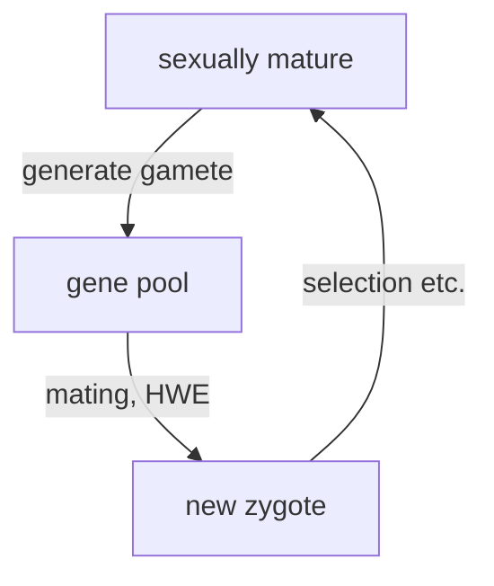

# Introduction
## What is population genetics? what does it study?

---

<!-- .slide: data-auto-animate -->
## What is biological evolution?

---

<!-- .slide: data-auto-animate -->
## What is biological evolution?

Biological evolution is the change over time in the **genetic composition of a population**, which changes due to the birth and death of individuals or the migration of individuals in or out of the population.

---

<!-- .slide: data-auto-animate -->
## What are the forces driving biological evolution?

---

<!-- .slide: data-auto-animate -->
## What are the population **events** driving biological evolution?
- birth <!-- element class="fragment" -->
- death <!-- element class="fragment" -->
- migration <!-- element class="fragment" -->

---
# Measuring genetic variation

---
<!-- .slide: data-auto-animate -->
## Types of genetic variation
- SNP
+ microsatellites
	+ What are microsatellites?
	+ what are they useful for?
+ CNV
---
## Types of genetic variation

> [!definition] Haplotype
> refer to the combination of alleles at multiple loci on the same chromosomal homolog.

---
### How do you draw the network (b) based on the alignment (a)?

![[20240502-IntroGenetAnal-18-4.png|800]]

%%comment on the different elements in the network map, e.g., circles, edges%%

--
![[20240502-IntroGenetAnal-18-5a.png]]

%%Most men have a rare Y chromosome haplotype (why?)%%

--
### Distribution of the star-cluster haplotype
![[20240502-IntroGenetAnal-18-5b.png]]

---
## How do you quantify the level of genetic variation?
![[20240502-IntroGenetAnal-18-4.png|800]]

<grid drag="85 45" drop="bottom" bg="forestgreen">

- count the number of variable sites
+ account for the length of the region (sequence)
+ account for the number of sequences (sample size)
+ Average # of differences between two sequences
</grid>

---
## Level of genetic variation across domains of life
![[20240505-Lefler-2012-fig1.png]][^1]
[^1]: Leffler et al. 2012. “Revisiting an Old Riddle: What Determines Genetic Diversity Levels within Species?” _PLoS Biology_ 10 (9): e1001388. [https://doi.org/10.1371/journal.pbio.1001388](https://doi.org/10.1371/journal.pbio.1001388).
<grid drag="50 80" drop="bottomright" bg="white"><!-- element class="fragment" -->
![[20240204-Intro to Genetic Analysis 11th ed-fig-18-15.png]]

M. Lynch and J. S. Conery, Science 2003

</grid>

---
<!-- .slide: data-auto-animate -->
## Gene pool and genotype frequencies
<split left="2" right="1">
![[20240504-IntroGenetAnal-18-7.png|600]]

- what is a gene pool?
+ ==**Locus**==: "region of interest", may be an entire gene, or a single nucleotide
+ ==**Allele**==: different "versions" of the sequence existing in a population
+ ==**Genotype**==: denotes the total allele combinations at a locus, e.g., two alleles for diploids.   
+ What are the genotype frequencies?
+ What are the allele frequencies?
</split>

---
<!-- .slide: data-auto-animate -->
## Gene pool and genotype frequencies
<split left="2" right="1">
![[20240504-IntroGenetAnal-18-7.png|600]]

- Knowing the allele frequency ($p_A = 18/32$), what is a "reasonable guess" of the genotype frequency (e.g., for $f_{A/A}$)?
+ How close is it to the observed genotype frequency?
+ Now reflect on your intuitive guess, what assumptions need to be made for it to work?
</split>

---
<!-- .slide: data-auto-animate -->
## Hardy-Weinberg Equilibrium
    Suppose allele frequency of A = p, and frequency of a = q

| $f_{A/A}$ | $f_{A/a}$ | $f_{a/a}$ |
| --------- | --------- | --------- |
| $p^2$     | $2pq$     | $q^2$     |
+ Assume the allele frequency of A is the same in females and males.
+ The probability of a baby frog to have A/A genotype is $p^2$
+ What other assumptions are needed?
+ ==Will any evolutionary force, such as migration and natural selection, affect the Hardy-Weinberg Equilibrium?==

---
<!-- .slide: data-auto-animate -->
## Hardy-Weinberg Equilibrium

<split left="1" right="2">

+ HWE only refers to the step of forming new zygotes.
+ Only assumptions needed are 
	+ random mating **with respect to the locus of interest**
	+ same allele frequencies in both sexes
+ Under these assumptions, HWE is restored _instantaneously_ upon mating
+ Often hear about "no selection, no migration" only needed for HWE frequencies to represent a **long term equilibrium**.
</split>

---
### HWE exercise
<split left="3" right="1">
> [!question]Question
> On the coastal islands of British Columbia there is a subspecies of black bear (*Ursus americanus kermodei*, Kermode’s bear). Many members of this black bear subspecies are white; they’re sometimes called spirit bears. These bears aren’t hybrids with polar bears, nor are they albinos. They are homozygotes for a recessive change at the MC1R gene. Individuals who are GG at this SNP are white, while AA and AG individuals are black. 
> The genotype counts for the MC1R polymorphism in a sample of bears from British Columbia’s island populations from Ritland et al. (2001) are: $AA=42, AG=24, GG=21$
> What are the expected frequencies of the three genotypes under HWE?

![[20240506-Coop-fig2.5.png|100]]

</split>
