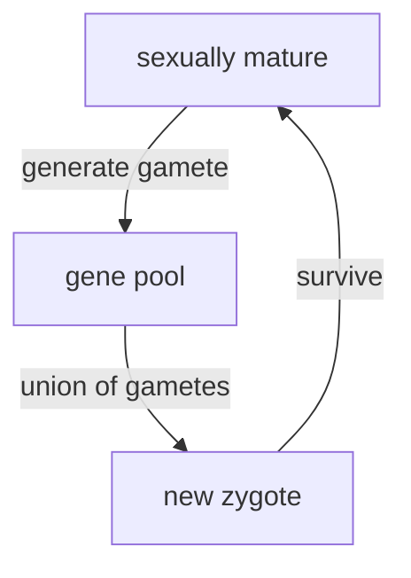
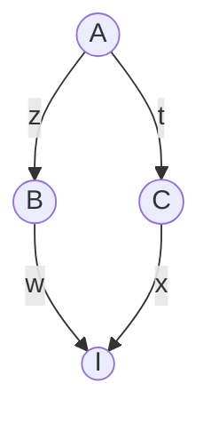
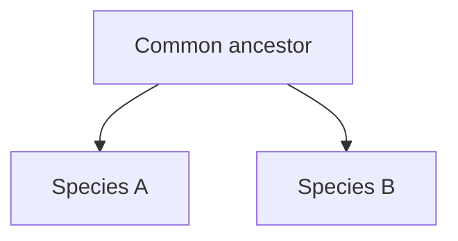

# Introduction
## What is population genetics? what does it study?

---

<!-- .slide: data-auto-animate -->
## What is biological evolution?

---

<!-- .slide: data-auto-animate -->
## What is biological evolution?

Biological evolution is the change over time in the **genetic composition of a population**, which changes due to the birth and death of individuals or the migration of individuals in or out of the population.

---

<!-- .slide: data-auto-animate -->
## What are the forces driving biological evolution?

---

<!-- .slide: data-auto-animate -->
## What are the population **events** driving biological evolution?
- birth <!-- element class="fragment" -->
- death <!-- element class="fragment" -->
- migration <!-- element class="fragment" -->

---
# Measuring genetic variation

---
<!-- .slide: data-auto-animate -->
## Types of genetic variation
- SNP
+ microsatellites
	+ What are microsatellites?
	+ what are they useful for?
+ CNV
---
## Types of genetic variation

> [!definition] Haplotype
> refer to the combination of alleles at multiple loci on the same chromosomal homolog.

---
### How do you draw the network (b) based on the alignment (a)?

![[20240502-IntroGenetAnal-18-4.png|800]][^1]
[^1]: Introduction to Genetic Analysis, ed 11, Fig. 18-4

%%comment on the different elements in the network map, e.g., circles, edges%%

---
![[20240502-IntroGenetAnal-18-5a.png]][^1]
[^1]: Introduction to Genetic Analysis, ed 11, Fig. 18-5(a)

%%Most men have a rare Y chromosome haplotype (why?)%%

---
### Distribution of the star-cluster haplotype
![[20240502-IntroGenetAnal-18-5b.png]][^1]

[^1]: Introduction to Genetic Analysis, ed 11, Fig. 18-5(b)

---
## How do you quantify the level of genetic variation?
![[20240502-IntroGenetAnal-18-4.png|800]]

<grid drag="85 45" drop="bottom" bg="forestgreen">

- count the number of variable sites
+ account for the length of the region (sequence)
+ account for the number of sequences (sample size)
+ Average # of differences between two sequences
</grid>

---
<!-- .slide: data-auto-animate -->
## Gene pool and genotype frequencies
<split left="2" right="1">
![[20240504-IntroGenetAnal-18-7.png|600]]

- what is a gene pool?
+ ==**Locus**==: "region of interest", may be an entire gene, or a single nucleotide
+ ==**Allele**==: different "versions" of the sequence existing in a population
+ ==**Genotype**==: denotes the total allele combinations at a locus, e.g., two alleles for diploids.   
+ What are the genotype frequencies?
+ What are the allele frequencies?
</split>

---
<!-- .slide: data-auto-animate -->
## Gene pool and genotype frequencies
<split left="2" right="1">
![[20240504-IntroGenetAnal-18-7.png|600]]

- Knowing the allele frequency ($p_A = 18/32$), what is a "reasonable guess" of the genotype frequency (e.g., for $f_{A/A}$)?
+ How close is it to the observed genotype frequency?
+ Now reflect on your intuitive guess, what assumptions need to be made for it to work?
</split>

---
<!-- .slide: data-auto-animate -->
## Hardy-Weinberg Equilibrium
    Suppose allele frequency of A = p, and frequency of a = q

| $f_{A/A}$ | $f_{A/a}$ | $f_{a/a}$ |
| --------- | --------- | --------- |
| $p^2$     | $2pq$     | $q^2$     |
+ Assume the allele frequency of A is the same in females and males.
+ The probability of a baby frog to have A/A genotype is $p^2$
+ What other assumptions are needed?
+ ==Will any evolutionary force, such as migration and natural selection, affect the Hardy-Weinberg Equilibrium?==

---
<!-- .slide: data-auto-animate -->
## Hardy-Weinberg Equilibrium

<split left="1" right="2">

+ HWE only refers to the step of forming new zygotes.
+ Only assumptions needed are 
	+ random mating **with respect to the locus of interest**
	+ same allele frequencies in both sexes
+ Under these assumptions, HWE is restored _instantaneously_ upon mating
+ Often hear about "no selection, no migration" only needed for HWE frequencies to represent a **long term equilibrium**.
</split>

---
### HWE exercise
<split left="3" right="1">
> [!question]Question
> On the coastal islands of British Columbia there is a subspecies of black bear (*Ursus americanus kermodei*, Kermode’s bear). Many members of this black bear subspecies are white; they’re sometimes called spirit bears. These bears aren’t hybrids with polar bears, nor are they albinos. They are homozygotes for a recessive change at the MC1R gene. Individuals who are GG at this SNP are white, while AA and AG individuals are black. 
> The genotype counts for the MC1R polymorphism in a sample of bears from British Columbia’s island populations from Ritland et al. (2001) are: $AA=42, AG=24, GG=21$
> What are the expected frequencies of the three genotypes under HWE?

![[20240506-Coop-fig2.5.png|100x]]

</split>

---
<!-- .slide: data-auto-animate -->
## Hardy-Weinberg Equilibrium

<split left="2" right="1">

- Challenge: how does HWE apply to X-linked loci?
- 
+ Male-baldness is an X-linked trait.
+ Androgen Receptor (AR) is an X-linked gene involved in male development.
+ an AR haplotype called _Eur-H1_ is **strongly associated with pattern baldness**.
+ _Eur-H1_ occurs at a frequency of 0.71 in Europe. What percentage of European men are expected to have this allele?
+ European women?

- ![[20240508-IntroGenetAnal-18-9.png|100x]]
</split>

[^1]: Introduction to Genetic Analysis, ed 11, Fig. 18-9

---
<!-- .slide: data-auto-animate -->
## Hardy-Weinberg Equilibrium

<split left="2" right="1">

  
  

- Solid line: mean genotype frequency; dashed line: HWE prediction. [Source](https://gcbias.org/2011/10/13/population-genetics-course-resources-Hardy--Weinberg-eq/)

- While HWE sounds too ideal to be a good fit to real data, researchers found that it actually holds remarkably well within populations. Since the main assumption for HWE to be true is that mating is random, how should one understand this?
</split>

---
<!-- .slide: data-auto-animate -->
## Major violations to HWE
### **Assortative mating**
+ Non-random mating **_with respect to_** the genotype at a locus
+ Ex: negative or disassortative mating
	+ Major histocompatibility complex (MHC) locus, involved in immune response to pathogens, higher heterzygosity = more diversity ≈ higher fitness.
	+ "sweaty shirt test": MHC alleles affect mating choice, prefer individuals with different MHC alleles

---
<!-- .slide: data-auto-animate -->
## Major violations to HWE
###  isolation by distance

<split left="1" right="1">
![[20240509-IntroGenetAnal-18-11b.png|500x]]

> Frequency variation for the FYnull allele of the Duffy blood group locus in Africa. [ Data from P. C. Sabeti et al., Science 312, 2006, 1614–1620.]
> 
> ==question==
> 
> what's the consequence of isolation by distance?
</split>

---
<!-- .slide: data-auto-animate -->
## Major violations to HWE
###  inbreeding
+ Mating between _close_ relatives.
+ How does inbreeding violate HWE?
+ Why is inbreeding potentially harmful in outcrossing populations (like humans)?
+ Selfing (extreme form of inbreeding) is common in animals and plants. What may be some advantages?
+ Identical-by-Descent (IBD)
---
<!-- .slide: data-auto-animate -->
### Measuring inbreeding
<split left="1" right="2">
![[20240509-IntroGenetAnal-18-12a.png|300x]]

+ **Inbreeding coefficient** (F): probability that two alleles in an individual trace back to the same copy in a common ancestor.
+ **Identical-by-Descent** (IBD): define two alleles to be IBD if they are identical due to transmission from a common ancestor in the past few generations
+ A "closed loop" indicates inbreeding.
</split>

---
<!-- .slide: data-auto-animate -->
### Measuring inbreeding
<split left="1" right="2">

- What's the probability that individual I is inbred? (calculating its inbreeding coefficient)
+ The alleles transmitted through each mating are labeled x, t, w and z. Use "~" to indicate IBD.
+ We wish to calculate $P(w \sim x)$
+ $P(x \sim t) = \frac{1}{2}; P(w \sim z) = \frac{1}{2}$
+ $P(z \sim t) = \frac{1}{2} + \frac{1}{2} F_A$
+ $F_I = P(z \sim t) \times P(w \sim z) \times P(x \sim t) = (\frac{1}{2})^3(1+F_A)$
</split>

---
<!-- .slide: data-auto-animate -->
### Consequences of inbreeding
==Examples of inbreeding effect on frequency of homozygous recessives==
![[20240509-IntroGenetAnal-table-18-3.png]][^1]
[^1]: Introduction to Genetic Analysis, ed 11, Table 18-3

---
### Consequence of inbreeding
<split left="2" right="1">
![[20240509-IntroGenetAnal-18-13.png|600x]]

> Frequency of genetic disorders among children of unrelated parents (blue columns) compared to that of children of parents who are first cousins (red columns). 
> 
> Data from C. Stern, Principles of Human Genetics, W. H. Freeman, 1973.

</split>

[^1]: Introduction to Genetic Analysis, ed 11, Fig. 18-13

---
## Review of Mon lecture
> [!Question]
> 1. Describe Hardy-Weinberg Equilibrium according to your understanding. What does it concern and what are its key assumptions?
> 2. Describe two ways for measuring the level of genetic variation.

note: $\pi = \sum_{i=1}^{n}(1-\sum_{j=1}^{m}(p_{ij}^2))$ 

---
## Level of genetic variation vary across species
![[20240505-Lefler-2012-fig1.png]][^1]
[^1]: Leffler et al. 2012. “Revisiting an Old Riddle: What Determines Genetic Diversity Levels within Species?” _PLoS Biology_ 10 (9): e1001388. [https://doi.org/10.1371/journal.pbio.1001388](https://doi.org/10.1371/journal.pbio.1001388).
<grid drag="50 80" drop="bottomright" bg="white"><!-- element class="fragment" -->
![[20240204-Intro to Genetic Analysis 11th ed-fig-18-15.png]]

M. Lynch and J. S. Conery, Science 2003

</grid>

---
## What forces shape the level and pattern of genetic variation?
+ How do new alleles enter the gene pool?
+ What forces drive changes in the frequency of alleles?
+ How can existing genetic variation recombine to create novel combinations of alleles?
+ Forces examined next
	1) mutation
	2) migration
	3) drift
	4) recombination
	5) selection

---
### Mutation
<split even>
![[20240509-IntroGenetAnal-table-18-5.png|300x500]]

- **Mutation rate** ($\mu$): probability that a copy of an allele changes to some other allelic form _in one generation_
+ doesn't just apply to a single nucleotide position - for any locus
+ in a single generation is important - other forces can change allele forms, but they act after the formation of zygote stage
+ data in human (circa 2009) gave an estimate of $\sim 3.0 \times 10^{-8}$ mutations/nucleotide/generation for a part of the Y-chromosome. if we extrapolate this to the entire human genome, we get an estimate of about 100 new mutations one would inherit from each of our parents _on average_.
</split>

---
### Migration
- In addition to mutation, migration is the other way by which new variation can be introduced into a population (not counting **new combinations**, see recombination)
- when there is isolation by distance, migration (or gene flow) is a homogenizing force, preventing allele frequencies from diverging too far
---
### Recombination
- Alleles are not gained or lost, but new combinations (haplotypes) are created by "mixing" existing ones.
+ Let's consider the observed and expected frequencies of the four possible haplotypes for two loci, each with two alleles (A and B, with alleles A/a and B/b)
	+ the four possible haplotypes are?
	+ if the frequencies of the alleles are $p_A$ and $p_B$, what are the expected frequencies for the four haplotypes naively?
	+ $P_{AB} = p_A \times p_B$ etc.
	+ If the observed frequencies are very close to the expected, we say that the two loci are in **linkage equilibrium**
	+ If not, then the loci are said to be in **linkage disequilibrium (LD)**.

---
<!-- .slide: data-auto-animate -->
### Linkage Disequilibrium

<split even>
![[20240509-IntroGenetAnal-18-17.png|500x]]

- Define LD as the difference (D) between the observed and expected frequencies
	+ $D=P_{AB}-p_A p_B$
+ ==Exercise==: calculate D for the two scenarios on the left

</split>

[^1]: Introduction to Genetic Analysis, ed 11, Fig. 18-17

---
<!-- .slide: data-auto-animate -->
### Linkage Disequilibrium

<split even>
![[20240509-IntroGenetAnal-18-14-part1.png|500x]]

- How LD arises
	+ consider a population with only AB and Ab. what happens when a new allele "a" arises at A locus, on a chromosome that already possess b. Is LD zero? or is it maximum?
	+ other than mutation, can migration cause LD? how?
+ How LD decays
	+ decays proportional to **time** and **recombination fraction**
	+ can be used to estimate the age of mutation, how?

</split>

[^1]: Introduction to Genetic Analysis, ed 11, Fig. 18-17

---
<!-- .slide: data-auto-animate -->
## Genetic drift and population size
- When calculating the expected genotype frequency from allele frequencies under Hardy-Weinberg Equilibrium, we made a sneaky assumption - the population size is assumed to be so large that we can "sample with replacement".
+ Real populations have finite population sizes. Sampling can lead to fluctuations in the allele frequency from generation to generation
	+ let's consider an extreme case: a population consisting of a single heterozygous (A/a) individual (N=1) at generation $t_0$. What's the allele frequency at $t_0$?
	+ suppose this species can self-fertilize, and that the population size remains at one in the next generation ($t_1$). what's the probability that the allele frequency will change (=="drift"==) to something other than its original value?
	+ what happens when we increase N to 2?

note: when N=1, there is a 50% chance that one of the two alleles will be fixed in the next generation. when N=2, the chance is 12.5%

---
<!-- .slide: data-auto-animate -->
## Genetic drift and population size
<dl>
	<dt>Drift</dt>
	<dd>any change in allele frequencies due to sampling error, not just loss or fixation of an allele</dd>
</dl>

> [!question]
> In a population with 500 individuals (N=500) and two alleles at a frequency of $p=q=0.5$, if the next generation has 501 copies of A and 499 copies of a, **has there been genetic drift**?

---
<!-- .slide: data-auto-animate -->
## Genetic drift and population size
- Drift is caused by sampling variation In a **finite population**.
+ When drift is operating, one can **calculate the probabilities of different outcomes**, but one **cannot accurately predict the outcome that will occur**
+ At a locus, drift continues to affect the allele frequency from generation to generation, until one allele is eventually fixed (and all others are lost), hence no more variation at that locus.
+ Drift **doesn't proceed in a specific direction**.

---
<!-- .slide: data-auto-animate -->
## Genetic drift and population size

	![[20240509-IntroGenetAnal-18-18a.png]]
	![[20240509-IntroGenetAnal-18-18b.png]]<!-- element class="fragment" -->
	![[20240509-IntroGenetAnal-18-18c.png]]<!-- element class="fragment" -->

note:
1. randomness of the processes - no two trajectories are identical
2. when N=10, a lot more populations became fixed for one of the two alleles (5/6), compared with 0/6 when N=500, shows that the effect of drift is inversely proportional to the size of the population

---
<!-- .slide: data-auto-animate -->
## Genetic drift and population size
- Prob(an allele goes to fixation) ~ frequency in the present generation
+ The initial frequency of a new allele in a diploid population of size N is $\frac{1}{2N}$
+ If N is even modestly large, e.g., $10^4$, the probability of its fixation is $5\times10^{-5}$, while the probability of it eventually being lost is close to 1.0!

![[20240509-IntroGenetAnal-18-19a.png]]<!-- element class="fragment" -->

[^1]:  Introduction to Genetic Analysis, ed 11, Fig. 18-19a

note: most new mutations are lost; average time to fixation | fixed is 4N

---
<!-- .slide: data-auto-animate -->
## Consequence of genetic drift
> [!important] Slightly deleterious alleles may be driven to fixation, while beneficial mutations are subject to loss

1) Strongly deleterious mutations are quickly lost. But slightly deleterious ones can drift to fixation - and when it does, it does so **quickly** (counterintuitive?)
	+ do you know that the fate of a mutation is not only determined by its functional impact (beneficial or deleterious), but also population size?
2) When a new beneficial mutation arise, there is an appreciable chance that it will be lost in the first few generations!
	+ the individual carrying the new mutation may not have the opportunity to reproduce.
	+ or it may not pass on the beneficial mutation (since by definition, a new mutation must be a single copy in a diploid individual)

---
<!-- .slide: data-auto-animate -->
## Molecular clock: implication of genetic drift
- Because of genetic drift, neutral mutations can become fixed, which we call "substitutions".
+ note the difference between "mutation" and "substitution"
+ the number of mutations that are expected to "appear" in a population in one generation is proportional to the number of copies in the gene pool, i.e., $2N\mu$, where $\mu$ denotes the mutation rate per locus per generation.
+ recall that the probability of fixation for a neutral mutation equals its initial frequency. for a new, neutral mutation, this is $\frac{1}{2N}$
+ therefore, the number of **fixed neutral mutations** per generation, which we will call "substitution rate", or k, is $k=2N\mu \times \frac{1}{2N}=\mu$
+ that is, the substitution rate for neutral mutations equal the rate at which they appear. this is only true for neutral mutations!

---
<!-- .slide: data-auto-animate -->
## Molecular clock: implication of genetic drift
<split left="1" right="2">

- $d$: number of **neutral substitutions** in a gene in both species since their divergence. 
+ $d=2tk$, where t is the divergence time.
+ $t=\frac{d}{2k}$, this provides a way to estimate divergence time based on the number of substitutions and estimate of substitution rate.
+ the estimated divergence time is in the unit of generations.
+ how to determine which substitutions are neutral?
+ can we observe all neutral substitutions?
+ how do we know mutation rate?
</split>

---
## Genetic drift and population size

> [!summary] Key concept
> - Population size is a key factor affecting genetic variation in populations.
> + Genetic drift is a stronger force in small populations than in large ones.
> + The probability that an allele will become fixed in (or lost from) a population by drift is a function of its frequency in the population and population size.
> + Most new mutations are lost from populations by drift.
> + The constant rate of substitution for neutral mutations can be used to estimate divergence time.

---
<!-- .slide: data-auto-animate -->
## Selection

> [!important] Natural selection (_Darwinian_)
> Populations change (_evolve_) over time as the environment (_nature_) favors (_selects_) features that enhance the ability to survive and reproduce.

---
<!-- .slide: data-auto-animate -->
## Selection

> [!question] Question
> We often use the phrase "_survival of the fittest_" to describe Darwinian selection. If an individual is physically strong, resistant to disease, and lives a long life, does this individual have a higher fitness?

---
<!-- .slide: data-auto-animate -->
## Selection
<split left="1" right="2">

+ **Natural selection** means individuals with certain features are more likely to _survive AND reproduce_ than other individuals lacking these features.
+ Mutation generates new variants; recombination creates new combinations (haplotypes), both of which affect the phenotype (feature).
+ Individuals with higher **fitness** are more likely to survive and reproduce, i.e., their alleles will have a higher frequency in the gene pool in next round of reproduction -> changing the allele frequency.
+ ==Where does selection operate in the left diagram==?

</split>

---
<!-- .slide: data-auto-animate -->
## How natural selection alters allele frequency?
- Consider a locus A with three genotypes, A/A, A/a, and a/a in a population. The initial allele frequencies are $p=0.1, q=0.9$
+ A is a favored dominant allele
  | Genotype | A/A | A/a | a/a |
  |-|-|-|-|
  | Average number of offspring (W) | 10 | 10 | 5 |
  | Relative fitness (w) | 1.0 | 1.0 | 0.5 |
  | Genotype frequency |  |  |  |

---
<!-- .slide: data-auto-animate -->
## How natural selection alters allele frequency?
- A is a favored dominant allele
  | | A/A | A/a | a/a |
  |-|-|-|-|
  |Average number of offspring (W) | 10 | 10 | 5 |
  | Relative fitness (w) | 1.0 | 1.0 | 0.5 |
  | Genotype frequency | 0.01 | 0.18  | 0.81  |
+ The relative contribution of each genotype to the gene pool is determined by **the product of its fitness and frequency**
  | Genotype | A/A | A/a | a/a | Sum |
  |-|-|-|-|-|
  | Relative contribution | 1 x 0.01 | 1 x 0.18 | 0.5 x 0.81 |
  | | = 0.01 | = 0.18 | = 0.405 | 0.595 |

---
<!-- .slide: data-auto-animate -->
## How natural selection alters allele frequency?
- The relative contribution of each genotype to the gene pool is determined by **the product of its fitness and frequency**
  | Genotype | A/A | A/a | a/a | Sum |
  |-|-|-|-|-|
  | Relative contribution | 0.01 | 0.18 | 0.405 | 0.595 |
  | Genotype frequency | 0.02 | 0.30 | 0.68 | 1.0 |
+ Now, let's use the genotype frequency to calculate the allele frequency, and then use that to calculate the expected genotype frequency in the next generation of zygotes under HWE
	+ $p'=?$ how much did $p$ change over one round of selection?
	+ $P_{AA}=?$, etc.

note:
1. $p'=0.02+0.15=0.17$
2. $P_{AA}=0.17^2=0.0289, P_{Aa}=2\times0.17\times0.83=0.2822, P_{aa}=0.83^2=0.6889$

---
<!-- .slide: data-auto-animate -->
## How natural selection alters allele frequency?
More generally

define $\bar{w}=p^2w_{A/A}+2pqw_{A/a}+q^2w_{a/a}$ is the mean relative fitness of the population

then, $p'=\frac{p^2w_{A/A}+\frac{1}{2}\times2pqw_{A/a}}{\bar{w}}=p\frac{pw_{A/A}+qw_{A/a}}{\bar{w}}$

 we define $w_A=pw_{A/A}+qw_{A/a}$ as allelic fitness, or mean fitness of allele A 

 $\Delta p=p'-p=p\frac{w_A}{\bar{w}}-p=\frac{p(w_A-\bar{w})}{\bar{w}}$ 

---
<!-- .slide: data-auto-animate -->
## Forms of selection
1. Directional selection
	+ Positive selection
	+ Purifying (negative) selection
2) Balancing selection
	+ if the heterozygous class has higher fitness than either homozygous ones, selection would favor the **maintenance of both alleles**.
	+ can you think of example scenarios for balancing selection?
	+ are there other types of selection that can **maintain genetic diversity** rather than **eliminating it**?

---
## Signatures of positive selection
![[20240509-IntroGenetAnal-18-22.png]]

<grid class="fragment fade-out" drag="45 62" drop="50 30" bg="white">
</grid>

[^1]: Introduction to Genetic Analysis, ed 11, Fig. 18-22
---
<!-- .slide: data-auto-animate -->
## Signatures of positive selection
- By driving the favored allele to fixation "very fast", positive selection causes a selective sweep that ends up
	+ also fix linked sites or drive the linked allele to high frequency
	+ hence removing genetic variation from the population
	+ creates LD
+ Note that this signature is **transient**.  What does this mean, why?

---
## Use selective sweep signature to infer positive selection

![[20240509-IntroGenetAnal-18-23.png|600x]]

[^1]: Introduction to Genetic Analysis, ed 11, Fig. 18-23

---
![[20240509-IntroGenetAnal-table-8-6.png]]

[^1]: Introduction to Genetic Analysis, ed 11, Table 18-6

---
![[20240509-IntroGenetAnal-18-24.png]]

[^1]: Introduction to Genetic Analysis, ed 11, Fig. 18-24

---