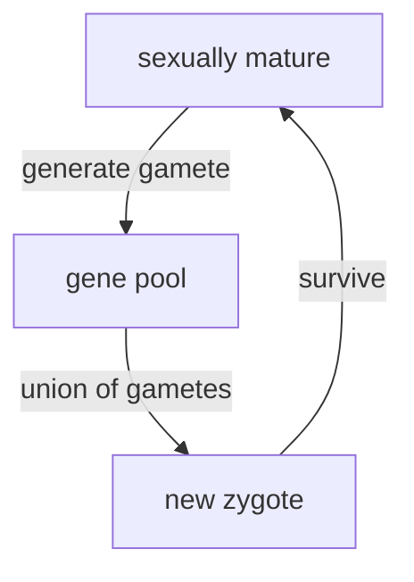
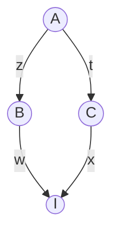
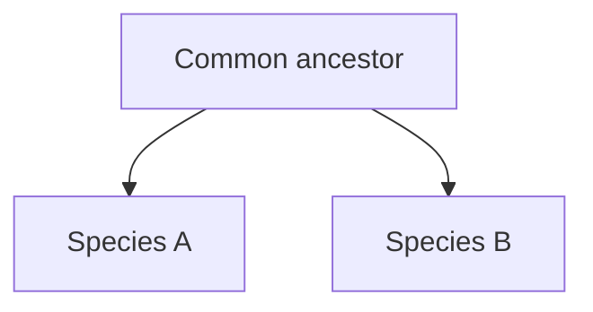

# About me
- 上海交大附中（99-02)
- 北京大学生命科学专业（02-06, 本科毕设：微流系统应用于细菌耐药性）
- 美国芝加哥大学演化与生态系（06-12, PhD thesis: evolution of gene regulatory networks and fly model of human disease）
- 美国哈佛大学系统生物学中心（12-17, Postdoc: evolution of stress response regulation in diverse yeasts）
- 美国爱荷华大学生物系（18-now, independent lab: evolution of stress response and adhesin gene families in fungal pathogens）
- https://binhe.org
- https://binhe-lab.org
- bin-he@uiowa.edu
---
![[20250512-Lecture-1-intro-1.png]]

---

![[20250512-Lecture-1-intro-2.png]]

---
# Introduction
## What is population genetics? what does it study?

---

<!-- .slide: data-auto-animate -->
## Population genetics
- A ==population== is a group of individuals from the same species that lives in the same geographic area and that actually or potentially interbreeds.
+ A ==gene pool== consists of all gametes made by all the breeding members of a population in a single generation.
+ Allele frequency: frequency of an allele in a population.
+ Population genetics studies the genetic variation in populations and how it changes over time

---

<!-- .slide: data-auto-animate -->
## Why study population genetics?

Biological evolution is the change over time in the **genetic composition of a population**, which changes due to the birth and death of individuals or the migration of individuals in or out of the population.

---

<!-- .slide: data-auto-animate -->
## What are the population **events** driving biological evolution?
- birth <!-- element class="fragment" -->
- death <!-- element class="fragment" -->
- migration <!-- element class="fragment" -->

---

<!-- .slide: data-auto-animate -->
## What are the forces driving biological evolution?
- mutation
- recombination
- natural selection
- migration
- (random/samplping) genetic drift

---
<!-- .slide: data-auto-animate -->
## Types of genetic variation
- SNP
+ microsatellites
	+ What are microsatellites?
	+ what are they useful for?
+ CNV
---
## Types of genetic variation

> [!definition] Haplotype
> refer to the combination of alleles at multiple loci on the same chromosomal homolog.

---
### How do you draw the network (b) based on the alignment (a)?

![[20240502-IntroGenetAnal-18-4.png|800]]<%? footnotes %>
[^1]: Introduction to Genetic Analysis, ed 11, Fig. 18-4

note: 
- comment on the different elements in the network map, e.g., circles, edges
- why do haplotypes exist? why do we have combinations of alleles?
- what breaks linkage?

---
![[20240502-IntroGenetAnal-18-5a.png]]<%? footnotes %>

[^1]: Introduction to Genetic Analysis, ed 11, Fig. 18-5(a)

note: Most men have a rare Y chromosome haplotype (why?)

---

### Distribution of the star-cluster haplotype
![[20240502-IntroGenetAnal-18-5b.png|800]]<%? footnotes %>

[^1]: Introduction to Genetic Analysis, ed 11, Fig. 18-5(b)

---
## Where do we come from?
![[20250510-IntroGenetAna-4a.png|800]]
<%? footnotes %>

[^1]: Introduction to Genetic Analysis, ed 11, Fig. 18-6

---
<!-- .slide: data-auto-animate -->
## Gene pool
- We have been evaluating genetic variations from the individual's  perspective ("horizontally" as a haplotype)
+ We can also look from a site / locus / gene perspective ("vertically").
+ Introduce the ==gene pool== concept

---
<!-- .slide: data-auto-animate -->
## Gene pool

> [!Gene pool]
> Sum total of all alleles in the breeding members of a population at a given time.

---

<!-- .slide: data-auto-animate -->
### Gene pool and allele frequencies
![[20240502-IntroGenetAnal-18-4.png|800]]

<grid drag="85 45" drop="bottom" bg="forestgreen">

+ ==**Locus**==: "region of interest", may be an entire gene, or a single nucleotide
+ ==**Allele**==: different "versions" of the sequence existing in a population
+ How many alleles are there if we take the entire haplotype region as a locus? what's the frequency of allele E (II-b)?
+ How about just looking at site 9? What's the frequency of G?
</grid>

---
<!-- .slide: data-auto-animate -->
## Gene pool and genotype frequencies
- In diploid organisms, **genotype** denotes the total allele combinations at a locus (AA, Aa, aa).
+ How do genotype frequencies depend on allele frequencies ($p_A$ and $p_a$)?
+ Why do we care?
	+ Genetic evolution = change in allele frequencies.
	+ Natural selection acts on fitness \<- phenotype \<- genotype

---

<!-- .slide: data-auto-animate -->
## Gene pool and genotype frequencies
<split left="2" right="1">
![[20240504-IntroGenetAnal-18-7.png|500]]

+ ==**Locus**==: "region of interest", may be an entire gene, or a single nucleotide
+ ==**Allele**==: different "versions" of the sequence existing in a population
+ ==**Genotype**==: denotes the total allele combinations at a locus, e.g., two alleles for diploids.   
+ What are the genotype frequencies?
+ What are the allele frequencies?
</split>

---
<!-- .slide: data-auto-animate -->
## Gene pool and genotype frequencies
<split left="2" right="1">
![[20240504-IntroGenetAnal-18-7.png|600]]

- Knowing the allele frequency ($p_A = 18/32$), what is a "reasonable guess" of the genotype frequency (e.g., for $f_{A/A}$)?
+ How close is it to the observed genotype frequency?
+ Now reflect on your intuitive guess, what assumptions need to be made for it to work?
</split>

---

<!-- .slide: data-auto-animate -->
## Hardy-Weinberg Law

Suppose allele frequency of $A = p$, and frequency of $a = q$

| $f_{A/A}$ | $f_{A/a}$ | $f_{a/a}$ |
| --------- | --------- | --------- |
| $p^2$     | $2pq$     | $q^2$     |
+ Assume the allele frequency of A is the same in females and males.
+ The probability of a baby frog to have A/A genotype is $p^2$
+ What other assumptions are needed?
+ ==Will any evolutionary force, such as migration and natural selection, affect the above expectation?==

---
<!-- .slide: data-auto-animate -->
## Hardy-Weinberg Law

<split left="1" right="2">

```mermaid
graph TD
	A[sexually mature]
	B[gene pool]
	C[new zygote]
	A-->|generate gamete|B
	B-->|union of gametes|C
	C-->|survive|A
```

+ The prediction of genotype frequency from the allele frequency only relies on the step of forming new zygotes.
+ For the prediction to hold, we just need: 
	+ random mating **with respect to the locus of interest**
	+ same allele frequencies in both sexes
+ Under these assumptions, the expected genotypic frequency distribution is achieved _instantaneously_ upon mating
+ Often hear about "no selection, no migration" only needed for HW frequencies to represent a **long term equilibrium**, known as Hardy Weinberg Equilibrium
</split>

---
### Consequences of Hardy Weinberg Law
1) Genotype frequencies can be estimated easily from allele frequencies.
2) Genetic variation can be maintained in a population.
3) There will be NO EVOLUTION when all of the following conditions are met
	+ ==Infinite population size (no drift); no mutation; no selection; no migration; random mating; equal allele frequencies in males and females==
	+ when all of the above are true, ==allele frequencies do not change from generation to generation==

---
<!-- .slide: data-auto-animate -->
## History of Hardy-Weinberg Law

<split left="3" right="5" gap="1">
![[20250512-Hardy-1908-Science 1.png|100x500]]

To The Editor of Science: ==I am reluctant to intrude in a discussion concerning matters of which I have no expert knowledge, and I should have expected the very simple point which I wish to make to have been familiar to biologists...==
  
... Suppose that Aa is a pair of Mendelian characters, A being dominant, and that in any given generation the numbers of pure dominants (AA), heterozygotes (Aa), and pure recessives (aa) are as $p:2q:r$. Finally, suppose that **the numbers are fairly large, so that the mating may be regarded as random, that the sexes are evenly distributed among the three varieties, and that all are equally fertile.** A little mathematics of the multiplication-table type is enough to show that in the next generation the numbers will be as
  
$(p + q)^2 : 2(p + q)(q + r) : (q + r)^2$ , or as $p_1:2q_1:r_1$, say.
  
whatever the values of $p, q$, and $r$ may be, the distribution will in any case continue unchanged after the second generation.
  
<i>Hardy, G. H. 2003. “Mendelian Proportions in a Mixed Population. 1908.” The Yale Journal of Biology and Medicine 76 (2): 79–80.</i>

</split>

---
<!-- .slide: data-auto-animate -->
## History of Hardy-Weinberg Law
+ ![[20250510-Masel-2012-Fig1.png|800]]
<%? footnotes %>

[^1]: Masel, Joanna. 2012. “Rethinking Hardy–Weinberg and Genetic Drift in Undergraduate Biology.” _BioEssays_ 34 (8): 701–10. [https://doi.org/10.1002/bies.201100178](https://doi.org/10.1002/bies.201100178).

---
### Using HW law to estimate heterozygote frequency
Example: cystic fibrosis, an autosomal recessive disease, has an incidence of 1 in 2500 in northern Europeans.  Estimate the frequency of carriers.

$q^2=1/2500$,

So, $q=1/50=0.02, p=1-q=0.98$

$2pq=2 \times 0.98 \times 0.02=0.0392$, or 1 in 25 people.

---
<!-- .slide: data-auto-animate -->
## Hardy-Weinberg Equilibrium

<split left="2" right="1">

  
  

- Solid line: mean genotype frequency; dashed line: HWE prediction. [Source](https://gcbias.org/2011/10/13/population-genetics-course-resources-Hardy--Weinberg-eq/)

- While HWE sounds too ideal to be a good fit to real data, researchers found that it actually holds remarkably well within populations. Since the main assumption for HWE to be true is that mating is random, how should one understand this?
</split>

---
<!-- .slide: data-auto-animate -->
### HWE exercise
In a human population, the genotype frequencies at one locus are 0.5 AA, 0.4 Aa, and 0.1 aa. The frequency of the A allele is:

 A) 0.20.

 B) 0.32.

 C) 0.50.

 D) 0.70.

 E) 0.90.

---
<!-- .slide: data-auto-animate -->
### HWE exercise
<split left="3" right="1">
> [!question]Question
> On the coastal islands of British Columbia there is a subspecies of black bear (*Ursus americanus kermodei*, Kermode’s bear). Many members of this black bear subspecies are white; they’re sometimes called spirit bears. These bears aren’t hybrids with polar bears, nor are they albinos. They are homozygotes for a recessive change at the MC1R gene. Individuals who are GG at this SNP are white, while AA and AG individuals are black. 
> The genotype counts for the MC1R polymorphism in a sample of bears from British Columbia’s island populations from Ritland et al. (2001) are: $AA=42, AG=24, GG=21$
> What are the expected frequencies of the three genotypes under HWE?

![[20240506-Coop-fig2.5.png|100x]]

</split>

---
<!-- .slide: data-auto-animate -->
## Hardy-Weinberg Law for X-linked loci

<split left="2" right="1">

- How does HW Law apply to X-linked loci?
 
+ Male-baldness is an X-linked trait.
+ Androgen Receptor (AR) is an X-linked gene involved in male development.
+ an AR haplotype called _Eur-H1_ is **strongly associated with pattern baldness**.
+ _Eur-H1_ occurs at a frequency of 0.71 in Europe. What percentage of European men are expected to have this allele?
+ European women?

- ![[20240508-IntroGenetAnal-18-9.png|100x]]
</split>

[^1]: Introduction to Genetic Analysis, ed 11, Fig. 18-9

---
<!-- .slide: data-auto-animate -->
## Major violations to HWE
### Assortative mating
+ Non-random mating **_with respect to_** the genotype at a locus
+ Ex: negative or disassortative mating
	+ Major histocompatibility complex (MHC) locus, involved in immune response to pathogens, higher heterzygosity = more diversity ≈ higher fitness.
	+ "sweaty shirt test": MHC alleles affect mating choice, prefer individuals with different MHC alleles

---
<!-- .slide: data-auto-animate -->
## Major violations to HWE
###  isolation by distance

<split left="1" right="1">
![[20240509-IntroGenetAnal-18-11b.png|500x]]

> Frequency variation for the FYnull allele of the Duffy blood group locus in Africa. [ Data from P. C. Sabeti et al., Science 312, 2006, 1614–1620.]
> 
> ==question==
> 
> what's the consequence of isolation by distance?
</split>

---
<!-- .slide: data-auto-animate -->
## Major violations to HWE
###  inbreeding
+ Mating between _close_ relatives.
+ How does inbreeding violate HWE?
+ Why is inbreeding potentially harmful in outcrossing populations (like humans)?
+ Selfing (extreme form of inbreeding) is common in animals and plants. What may be some advantages?
+ Identical-by-Descent (IBD)
---
<!-- .slide: data-auto-animate -->
### Measuring inbreeding
<split left="1" right="2">
![[20240509-IntroGenetAnal-18-12a.png|300x]]

+ **Inbreeding coefficient** (F): probability that two alleles in an individual trace back to the same copy in a common ancestor.
+ **Identical-by-Descent** (IBD): define two alleles to be IBD if they are identical due to transmission from a common ancestor in the past few generations
+ A "closed loop" indicates inbreeding.
</split>

---
<!-- .slide: data-auto-animate -->
### Measuring inbreeding
<split left="1" right="2">

```mermaid
graph TD
	A((A)) --> | z | B((B))
	A --> |t| C((C))
	B --> |w| I((I))
	C --> |x| I
```

- What's the probability that individual I is inbred? (calculating its inbreeding coefficient)
+ The alleles transmitted through each mating are labeled x, t, w and z. Use "~" to indicate IBD.
+ We wish to calculate $P(w \sim x)$
+ $P(x \sim t) = \frac{1}{2}; P(w \sim z) = \frac{1}{2}$
+ $P(z \sim t) = \frac{1}{2} + \frac{1}{2} F_A$
+ $F_I = P(z \sim t) \times P(w \sim z) \times P(x \sim t) = (\frac{1}{2})^3(1+F_A)$
</split>

---
<!-- .slide: data-auto-animate -->
### Consequences of inbreeding
==Examples of inbreeding effect on frequency of homozygous recessives==
![[20240509-IntroGenetAnal-table-18-3.png]][^1]
[^1]: Introduction to Genetic Analysis, ed 11, Table 18-3

---
### Consequence of inbreeding
<split left="2" right="1">
![[20240509-IntroGenetAnal-18-13.png|600x]]

> Frequency of genetic disorders among children of unrelated parents (blue columns) compared to that of children of parents who are first cousins (red columns). 
> 
> Data from C. Stern, Principles of Human Genetics, W. H. Freeman, 1973.

</split>

[^1]: Introduction to Genetic Analysis, ed 11, Fig. 18-13

---
## Review of Monday lecture
> [!summary]
> 1. Incorporate the inbreeding coefficient in the calculation of expected genotypic frequency.
> 2. HWP applied to forensics

note: $\pi = \sum_{i=1}^{n}(1-\sum_{j=1}^{m}(p_{ij}^2))$ 

---

> [!quote] Microsatellites are regions of the genome where individuals vary for the number of copies of some short DNA repeat that they carry. These regions are often highly variable across individuals, making them a suitable way to identify individuals from a DNA sample. This so-called DNA fingerprinting has a range of applications from establishing paternity and identifying human remains to matching individuals to DNA samples from a crime scene. The FBI make use of the CODIS[^1] database. The CODIS database contains the genotypes of over 13 million people, most of whom have been convicted of a crime. Most of the profiles record genotypes at 13 microsatellite loci that are tetranucleotide repeats (since 2017, 20 sites have been genotyped).<!-- element class="spacious" -->

[^1]: CODIS: Combined DNA Index System 

---

<grid drag="45 40" drop="1 10" align="top">
The allele counts for two loci (D16S539 and TH01) are shown in the two tables below for a sample of 155 people of European ancestry. You can assume these two loci are on different chromosomes.

![[20250513-Coop-DNA-fingerprint-allele-freq-table.png]]

You extract a DNA sample from a crime scene. The genotype is 100/80 at the D16S539 locus and 70/93 at TH01.
</grid>

<grid drag="50 100" drop="-1 10" align="top">
A) You have a suspect in custody. Assuming this suspect is innocent and of European ancestry, what is the probability that their genotype would match this profile by chance (a false- match probability)?<!-- element class="question" -->

B) The FBI uses ≥ 13 markers. Why is this higher number necessary to make the match statement convincing evidence in court?<!-- element class="question" -->

C) An early case that triggered debate among forensic geneticists was a crime among the Abenaki, a Native American community in Vermont (see Lewontin, 1994, for discussion). There was a DNA sample from the crime scene, and the perpetrator was thought likely to be a member of the Abenaki community. Given that allele frequencies vary among populations, why would people be concerned about using data from a non-Abenaki population to compute a false match probability?<!-- element class="question" -->
</split>

note:
- $p(100) = 0.042, p(80) = 0.01$
- $p(70) = 0.14, p(93) = 0.25$
- A: $P = p(100)*p(80)*p(70)*p(93) = 1.37\times 10^{-5}$
- B: the above is not strong enough evidence. courts typically require a random match probability lower than one billionth to one trillionth to convict. this is because in some large metropolitan area, there may be hundreds to thousands of people with the same two marker allele combination.

---
## How do you quantify the level of genetic variation?
![[20240502-IntroGenetAnal-18-4.png|800]]

<grid drag="85 45" drop="bottom" bg="forestgreen">

- count the number of variable sites, or $k$
+ account for the length of the region (sequence)
+ account for the number of sequences (sample size)
+ Average # of differences between two sequences
</grid>

---
## Level of genetic variation vary across species
![[20240505-Lefler-2012-fig1.png]]

Leffler et al. 2012. “Revisiting an Old Riddle: What Determines Genetic Diversity Levels within Species?” _PLoS Biology_ 10 (9): e1001388. [https://doi.org/10.1371/journal.pbio.1001388](https://doi.org/10.1371/journal.pbio.1001388).
<grid drag="50 80" drop="bottomright" bg="white"><!-- element class="fragment" -->
![[20240204-Intro to Genetic Analysis 11th ed-fig-18-15.png]]

M. Lynch and J. S. Conery, Science 2003

</grid>

note:
- neutral theory predicts the level of genetic diversity scales with the effective population size $\theta=4N_e \mu$
- the range of genetic diversity in a sample of 167 species is 0.01%-8%
- this is likely several orders of magnitude smaller than the range of effective population size among species (think some vertebrate species with < 100 breeding individuals vs plants or bacteria with a very large census population size)
- diversity levels in the gibbon _Hoolock leuconedys_ are 0.21% for a current census population size estimate of 10,000–50,000 individuals (http://www.iucnredlist.org), whereas in _Drosophila buzzatii_, a species distributed worldwide, they are only ,10 times higher (1.94%) when population size estimates are on the same order per hectare [62]

---
## What forces drive biological evolution?
+ Recall that HW Law predicts **No Evolution** when several conditions are met. They are also the forces driving biological evolution.
+ How do new alleles enter the gene pool?
+ How do existing variation give rise to new combinations?
+ What forces drive changes in the frequency of alleles?
+ We will examine the following five forces in detail
	1) mutation
	2) migration
	3) random genetic drift
	4) recombination
	5) selection

---
## Mutation
<split even>
![[20240509-IntroGenetAnal-table-18-5.png|300x500]]

- Generates new alleles, hence the **ultimate source of genetic **variation**.
+ Mutations are **random** with respect to fitness.
+ Mutation rate ($\mu$) is usually low, $10^{-8}$ per nucleotide per generation in mammalian nuclear genomes. For a gene that is 1,000 bp long, it takes ~70,000 generations for 50% of the original allele to be mutated.
+ data in human (circa 2009) gave an estimate of $\sim 3.0 \times 10^{-8}$ mutations/nucleotide/generation for a part of the Y-chromosome. if we extrapolate this to the entire human genome, we get an estimate of about 100 new mutations one would inherit from each of our parents _on average_.
</split>

---
## Migration
- In addition to mutation, migration is the other way by which new variation can be introduced into a population (not counting **new combinations**, see recombination)
- when there is isolation by distance, migration (or gene flow) is a homogenizing force, preventing allele frequencies from diverging too far
---
## Recombination
- A critical force sculpting the pattern of genetic variation in populations.
+ Alleles are not gained or lost, but new combinations (haplotypes) are created by "shuffling" existing ones. For example, suppose at $t_0$, the population consists of two genotypes, "AB" and "ab". After some time and if recombination occurs between the two loci, we start to get two NEW genotypes, i.e., "Ab" and "aB"
+ Let's consider the observed and expected frequencies of the four possible haplotypes for two loci, each with two alleles (A and B, with alleles A/a and B/b)
	+ the four possible haplotypes are?
	+ if the frequencies of the alleles are $p_A$ and $p_B$, what are the expected frequencies for the four haplotypes naively?
	+ $P_{AB} = p_A \times p_B$ etc.
	+ If the observed frequencies are very close to the expected, we say that the two loci are in **linkage equilibrium**
	+ If not, then the loci are said to be in **linkage disequilibrium (LD)**.

---
<!-- .slide: data-auto-animate -->
### Linkage Disequilibrium

<split even>
![[20240509-IntroGenetAnal-18-17.png|500x]]

+ Define LD as the difference (D) between the observed and expected frequencies
	+ $D=P_{AB}-p_A p_B$
+ ==Exercise==: calculate D for the two scenarios on the left

</split>

[^1]: Introduction to Genetic Analysis, ed 11, Fig. 18-17

---
<!-- .slide: data-auto-animate -->
### Linkage Disequilibrium

<split even>
![[20240509-IntroGenetAnal-18-14-part1.png|500x]]

- How LD arises
	+ consider a population with only AB and Ab. what happens when a new allele "a" arises at A locus, on a chromosome that already possess b. Is LD zero? or is it maximum?
	+ other than mutation, can migration cause LD? how?
+ How LD decays
	+ decays proportional to **time** and **recombination fraction**
	+ can be used to estimate the age of mutation, how?

</split>

[^1]: Introduction to Genetic Analysis, ed 11, Fig. 18-17

note: 
- An allele in the G6PD gene called $A^-$ leads to strongly reduced enzyme activity, and individuals who carry this allele develop hemolytic anemia. However, this allele also confers a 50 percent reduction in the risk of severe malaria in carriers.

---
<!-- .slide: data-auto-animate -->
## Genetic drift and population size
- When calculating the expected genotype frequency from allele frequencies under Hardy-Weinberg Equilibrium, we made a sneaky assumption - the population size is assumed to be so large that we can "sample with replacement".
+ Real populations have finite population sizes. Sampling can lead to fluctuations in the allele frequency from generation to generation
	+ let's consider an extreme case: a population consisting of a single heterozygous (A/a) individual (N=1) at generation $t_0$. What's the allele frequency at $t_0$?
	+ suppose this species can self-fertilize, and that the population size remains at one in the next generation ($t_1$). what's the probability that the allele frequency will change (=="drift"==) to something other than its original value?
	+ how about at generation $t_2$?
	+ what happens when we increase the population size (N) to 2?

note: 
- at $t_2$, H = 1/4. In general, heterozygosity decays 
- when N=1, there is a 50% chance that one of the two alleles will be fixed in the next generation. when N=2, the chance is 12.5%

---
<!-- .slide: data-auto-animate -->
## Genetic drift and population size
- Genetic drift reduces neutral genetic diversity by causing, as alleles slowly drift to high or low frequencies and get either fixed or lost.
+ Genetic drift operates in both small and large populations, but its effect is more obvious in small populations (think of it as a force that scales with 1/2N)
+ Define $H$, or heterozygosity, as the probability that two randomly sampled alleles at generation t ($H_t$) are non-identical. Without mutation, $H$ decays with time at a "speed" that is inversely proportional to $N$.
+ $H_t = (1-\frac{1}{2N})^{t} H_0$
+ 1/2N << 1, $H_t = H_0 e^{-t/2N}$
---
<!-- .slide: data-auto-animate -->
<grid drag="100 10" drop="1 1">
## Genetic drift and population size
</grid>

<grid drag="45 80" drop="1 10" align="top">
![[20250513-Jianzhi-lecture-genetic-drift-pic.png|500]]
</grid>

<grid drag="50 40" drop="-1 10" align="top">
<dl>
	<dt>Drift</dt>
	<dd>any change in allele frequencies due to sampling error, not just loss or fixation of an allele</dd>
</dl>
</grid>

<grid drag="50 40" drop="-1 35" align="top">
+ Drift is caused by sampling variation In a **finite population**.
+ When drift is operating, one can **calculate the probabilities of different outcomes**, but one **cannot accurately predict the outcome that will occur**
+ Drift **doesn't proceed in a specific direction**.
</grid>

---
<!-- .slide: data-auto-animate -->
## Genetic drift and population size

	![[20240509-IntroGenetAnal-18-18a.png]]
	![[20240509-IntroGenetAnal-18-18b.png]]<!-- element class="fragment" -->
	![[20240509-IntroGenetAnal-18-18c.png]]<!-- element class="fragment" -->

note:
1. randomness of the processes - no two trajectories are identical
2. when N=10, a lot more populations became fixed for one of the two alleles (5/6), compared with 0/6 when N=500, shows that the effect of drift is inversely proportional to the size of the population

---
<!-- .slide: data-auto-animate -->
## Genetic drift and population size

![[20240509-IntroGenetAnal-18-19a.png|800]][^1]
+ Prob(an allele goes to fixation) ~ frequency in the present generation
+ The initial frequency of a new allele in a diploid population of size N is $\frac{1}{2N}$
+ If N is even modestly large, e.g., $10^4$, the probability of its fixation is $5\times10^{-5}$, while the probability of it eventually being lost is close to 1.0 (diagram is misleading)!
+ When a new mutation is lucky enough to get fixed, it takes on average 4N generations.

[^1]: Introduction to Genetic Analysis, ed 11, Fig. 18-19a

note: most new mutations are lost; average time to fixation | fixed is 4N

---
<!-- .slide: data-auto-animate -->
## Consequence of genetic drift
> [!important] Slightly deleterious alleles may be driven to fixation, while beneficial mutations are subject to loss

1) Strongly deleterious mutations are quickly lost. But slightly deleterious ones can drift to fixation - and when it does, it does so **quickly** (counterintuitive?)
	+ do you know that the fate of a mutation is not only determined by its functional impact (beneficial or deleterious), but also population size?
2) When a new beneficial mutation arise, there is an appreciable chance that it will be lost in the first few generations!
	+ the individual carrying the new mutation may not have the opportunity to reproduce.
	+ or it may not pass on the beneficial mutation (since by definition, a new mutation must be a single copy in a diploid individual)

---
<!-- .slide: data-auto-animate -->
## Molecular clock: implication of genetic drift
- Because of genetic drift, neutral mutations can become fixed, which we call "substitutions".
+ note the difference between "mutation" and "substitution"
+ the number of mutations that are expected to "appear" in a population in one generation is proportional to the number of copies in the gene pool, i.e., $2N\mu$, where $\mu$ denotes the mutation rate per locus per generation.
+ recall that the probability of fixation for a neutral mutation equals its initial frequency. for a new, neutral mutation, this is $\frac{1}{2N}$
+ therefore, the number of **fixed neutral mutations** per generation, which we will call "substitution rate", or k, is $k=2N\mu \times \frac{1}{2N}=\mu$
+ that is, the substitution rate for neutral mutations equal the rate at which they appear. this is only true for neutral mutations!

--
<!-- .slide: data-auto-animate -->
## Molecular clock: implication of genetic drift
<split left="1" right="2">

```mermaid
graph TD
	O[Common ancestor]-->A[Species A]
	O[Common ancestor]-->B[Species B]
```

- $d$: number of **neutral substitutions** in a gene in both species since their divergence. 
+ $d=2tk$, where t is the divergence time.
+ $t=\frac{d}{2k}$, this provides a way to estimate divergence time based on the number of substitutions and estimate of substitution rate.
+ the estimated divergence time is in the unit of generations.
+ how to determine which substitutions are neutral?
+ can we observe all neutral substitutions?
+ how do we know mutation rate?
</split>

---
## Genetic drift and population size

> [!summary] Key concept
> - Population size is a key factor affecting genetic variation in populations.
> + Genetic drift is a stronger force in small populations than in large ones.
> + The probability that an allele will become fixed in (or lost from) a population by drift is a function of its frequency in the population and population size.
> + Most new mutations are lost from populations by drift.
> + The constant rate of substitution for neutral mutations can be used to estimate divergence time.

---
<!-- .slide: data-auto-animate -->
## Selection

> [!important] Natural selection (_Darwinian_)
> Populations change (_evolve_) over time as the environment (_nature_) favors (_selects_) features that enhance the ability to survive and reproduce.

---
<!-- .slide: data-auto-animate -->
## Selection

> [!question] Question
> We often use the phrase "_survival of the fittest_" to describe Darwinian selection. If an individual is physically strong, resistant to disease, and lives a long life, does this individual have a higher fitness?

---
<!-- .slide: data-auto-animate -->
## Selection
<split left="1" right="2">

```mermaid
graph TD
	A[sexually mature]
	B[gene pool]
	C[new zygote]
	A-->|generate gamete|B
	B-->|union of gametes|C
	C-->|survive|A
```

+ **Natural selection** means individuals with certain features are more likely to _survive AND reproduce_ than other individuals lacking these features.
+ Mutation generates new variants; recombination creates new combinations (haplotypes), both of which affect the phenotype (feature).
+ Individuals with higher **fitness** are more likely to survive and reproduce, i.e., their alleles will have a higher frequency in the gene pool in next round of reproduction -> changing the allele frequency.
+ ==Where does selection operate in the left diagram==?

</split>

---
<!-- .slide: data-auto-animate -->
## How natural selection alters allele frequency?
<split left="2" right="1">
![[20240520-Coop-fig10.1.png|400]]

> Figure 10.1: The rapid evolution of drug-resistant SHIV. The viral load of SHIV in the blood of a macaque (black line), the frequency of a drug resistance mutation (red line). Data from Feder et al. (2017).

</split>

[^1]: Graham Coop, Population and Quantitative Genetics, v1.2, 2020 https://github.com/cooplab/popgen-notes/releases/tag/v1.1

---
<!-- .slide: data-auto-animate -->
## How natural selection alters allele frequency?
- Consider a locus A with three genotypes, A/A, A/a, and a/a in a population. The initial allele frequencies are $p=0.1, q=0.9$
+ A is a favored dominant allele
  | Genotype | A/A | A/a | a/a |
  |-|-|-|-|
  | Average number of offspring (W) | 10 | 10 | 5 |
  | Relative fitness (w) | 1.0 | 1.0 | 0.5 |
  | Genotype frequency |  |  |  |

---
<!-- .slide: data-auto-animate -->
## How natural selection alters allele frequency?
- A is a favored dominant allele
  | | A/A | A/a | a/a |
  |-|-|-|-|
  |Average number of offspring (W) | 10 | 10 | 5 |
  | Relative fitness (w) | 1.0 | 1.0 | 0.5 |
  | Genotype frequency | 0.01 | 0.18  | 0.81  |
+ The relative contribution of each genotype to the gene pool is determined by **the product of its fitness and frequency**
  | Genotype | A/A | A/a | a/a | Sum |
  |-|-|-|-|-|
  | Relative contribution | 1 x 0.01 | 1 x 0.18 | 0.5 x 0.81 |
  | | = 0.01 | = 0.18 | = 0.405 | 0.595 |

---
<!-- .slide: data-auto-animate -->
## How natural selection alters allele frequency?
- The relative contribution of each genotype to the gene pool is determined by **the product of its fitness and frequency**
  | Genotype | A/A | A/a | a/a | Sum |
  |-|-|-|-|-|
  | Relative contribution | 0.01 | 0.18 | 0.405 | 0.595 |
  | Genotype frequency | 0.02 | 0.30 | 0.68 | 1.0 |
+ Now, let's use the genotype frequency to calculate the allele frequency, and then use that to calculate the expected genotype frequency in the next generation of zygotes under HWE
	+ $p'=?$ how much did $p$ change over one round of selection?
	+ $P_{AA}=?$, etc.

note:
1. $p'=0.02+0.15=0.17$
2. $P_{AA}=0.17^2=0.0289, P_{Aa}=2\times0.17\times0.83=0.2822, P_{aa}=0.83^2=0.6889$

---
<!-- .slide: data-auto-animate -->
## How natural selection alters allele frequency?
More generally

define $\bar{w}=p^2w_{A/A}+2pqw_{A/a}+q^2w_{a/a}$ is the mean relative fitness of the population

then, $p'=\frac{p^2w_{A/A}+\frac{1}{2}\times2pqw_{A/a}}{\bar{w}}=p\frac{pw_{A/A}+qw_{A/a}}{\bar{w}}$

 we define $w_A=pw_{A/A}+qw_{A/a}$ as allelic fitness, or mean fitness of allele A 

 $\Delta p=p'-p=p\frac{w_A}{\bar{w}}-p=\frac{p(w_A-\bar{w})}{\bar{w}}$ 

---
<!-- .slide: data-auto-animate -->
## Forms of selection
1. Directional selection
	+ Positive selection
	+ Purifying (negative) selection
2) Balancing selection
	+ if the heterozygous class has higher fitness than either homozygous ones, selection would favor the **maintenance of both alleles**.
	+ can you think of example scenarios for balancing selection?
	+ are there other types of selection that can **maintain genetic diversity** rather than **eliminating it**?

---
## Signatures of positive selection
![[20240509-IntroGenetAnal-18-22.png]]

<grid class="fragment fade-out" drag="45 62" drop="50 30" bg="white">
</grid>

[^1]: Introduction to Genetic Analysis, ed 11, Fig. 18-22
---
<!-- .slide: data-auto-animate -->
## Signatures of positive selection
- By driving the favored allele to fixation "very fast", positive selection causes a selective sweep that ends up
	+ also fix linked sites or drive the linked allele to high frequency
	+ hence removing genetic variation from the population
	+ creates LD
+ Note that this signature is **transient**.  What does this mean, why?

---
## Use selective sweep signature to infer positive selection

![[20240509-IntroGenetAnal-18-23.png|600x]]

[^1]: Introduction to Genetic Analysis, ed 11, Fig. 18-23

---
![[20240509-IntroGenetAnal-table-8-6.png]]

[^1]: Introduction to Genetic Analysis, ed 11, Table 18-6

---
![[20240509-IntroGenetAnal-18-24.png]]

[^1]: Introduction to Genetic Analysis, ed 11, Fig. 18-24

---
